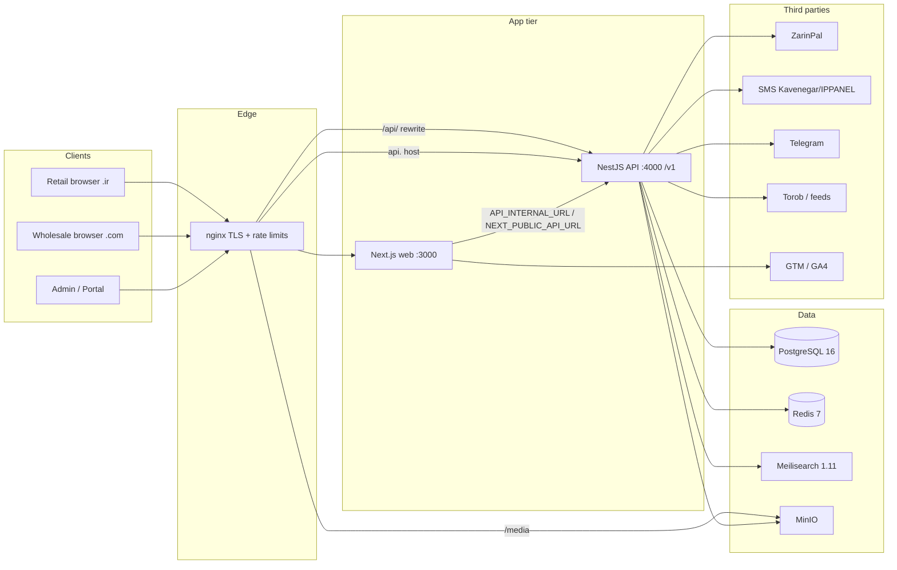

# Current System Audit — Retail & Wholesale (TASK-20260809-002)

**Document type:** Evidence-backed audit of the existing dual-channel commerce platform  
**Program:** Retail-Wholesale-Completion-Package / `MASTER.md`  
**Audit date:** 2026-08-09  
**Authoritative worktree:** `D:/soft/Claud/porje/Site-B2B-wt-TASK-20260809-002`  
**Branch:** `ai/TASK-20260809-002-retail-wholesale-completion`  
**Commit under audit:** `e3f71d2` (`e3f71d2fc0709caea9b2e34aad9a1a05357f0c50`) — *Fix robots sitemap and blog page build errors*  
**Environments examined:** Local worktree source + config + CI workflow + documented production topology + **authorized production readonly HTTP smoke** (2026-08-09).  
**Overall confidence:** **Medium-high** — structure, channel routing, gates (build/tsc/lint/test PASS after remap), and prod liveness evidenced; purchase E2E and restore drills remain **NOT RUN** (accepted-with-expiry through 2026-09-09).

### Quality baseline (executive; supersedes Phase-1 FAIL rows below where noted)

| Gate | Result | Evidence |
|------|--------|----------|
| web/api `tsc` | PASS exit 0 | handoff |
| `npm run build` | PASS exit 0 | handoff 02:27:30Z |
| remapped `npm run lint`/`test` | PASS exit 0 | handoff 02:48Z+; Reviewer 09:15Z |
| Prod health + storefronts | PASS | smoke script + probes |
| Purchase E2E | NOT RUN | C1 accepted-with-expiry |

---

## 1. Executive summary

پوشاک ترنم runs as a **single monorepo core** with **two storefronts**: wholesale B2B on `poshaktaranom.com` and retail B2C on `poshaktaranom.ir` / `www.poshaktaranom.ir`, sharing NestJS API, PostgreSQL inventory/admin, Redis, Meilisearch, and MinIO (`docs/B2C.md`; `docker-compose.yml`; `nginx/nginx.conf`).

**In scope for this program:** stabilize and complete existing retail + wholesale journeys — not a website builder, SaaS, or multi-tenant platform (`Retail-Wholesale-Completion-Package/MASTER.md`).

**Baseline quality gates (worktree, same commit `e3f71d2`, per `.ai-dos/tasks/handoff.md`):**

| Gate | Command | Result |
|------|---------|--------|
| Install | `npm install --no-fund --no-audit` | exit **0** |
| Web typecheck | `npm run type-check -w @taranom/web` / `tsc --noEmit` | exit **0** |
| Lint | `npm run lint` | exit **1** — `eslint` missing for `@taranom/api` |
| Test | `npm run test` | exit **1** — `jest` missing for `@taranom/api` |
| API typecheck | `cd apps/api && npx tsc --noEmit` | **NOT RUN** this session (UNKNOWN) |
| Build | `npm run build` | **PASS** (exit 0; turbo cache hit — handoff 2026-08-09T02:27:30Z; supersedes audit-time NOT RUN) |

**Top risks (preview):** (1) API lint/test tooling gap blocks DoD gates; (2) production build/health/commit unverified this session; (3) dual schema path (TypeORM migrations + `scripts/apply-production-schema.sql`) drift; (4) critical retail/wholesale E2E acceptance not yet recorded for TASK-20260809-002; (5) edge middleware admin/portal gate trusts cookies (`taranom_token` / `taranom_role`) while real authorization must remain API JWT — soft UI gate only.

**Non-goals confirmed:** no `apps/*` edits in phase-1; dirty checkout at `D:/soft/Claud/porje/Site B2B` is **not obsolete** and must not be overwritten.

---

## 2. Repository map

| Path | Role | Stack / notes | Evidence |
|------|------|---------------|----------|
| Root `package.json` | Monorepo `taranom-platform` | npm workspaces + turbo; Node `>=20`, npm `>=10.9.2` | `package.json:1-27` |
| `apps/web` | Next.js storefronts + admin + portal | Next `^15.1`, React `^19`, Tailwind, Zustand, TipTap | `apps/web/package.json` |
| `apps/api` | NestJS API (Fastify) | Nest `^10`, TypeORM, PG, Redis, Meili, MinIO, JWT | `apps/api/package.json` |
| `packages/shared-types` | Shared TS types | workspace package | `packages/shared-types/package.json` |
| `packages/persian-utils` | Jalali / IRR helpers | `jalaali-js` | `packages/persian-utils/package.json` |
| `nginx/` | TLS reverse proxy, channel hosts | `nginx/nginx.conf` | hosts `.com` / `.ir` / `api.` |
| `scripts/` | Deploy, E2E, schema safety-net | e.g. `auto-deploy.sh`, `e2e-purchase-test.sh`, `apply-production-schema.sql` | `scripts/` listing |
| `docs/` | WORKLOG, B2C, conventions, blog guides | Operational memory | `docs/WORKLOG.md`, `docs/B2C.md`, `docs/conventions.md` |
| `.github/workflows/ci.yml` | CI lint-and-build + optional deploy | OTP spec + tsc + builds; deploy via SSH on `workflow_dispatch` | `.github/workflows/ci.yml` |
| `design-system/b2c/` | B2C design system | referenced by `docs/B2C.md` | path cited in B2C |
| `Retail-Wholesale-Completion-Package/` | Completion program (copied into worktree) | MASTER + templates 00–13, 99 | worktree untracked |
| `.ai-dos/` | AI-DOS governance | tasks, status, quality gates | `.ai-dos/*` |

**Owners (process):** TASK-20260809-002 owner `cursor:orchestrator-TASK-20260809-002`; phase-1 claims are governance + required docs only (`.ai-dos/tasks/active.yaml`). Product code ownership for remediation requires claim expansion.

**Build / deploy paths:**

- Local: `npm install` → `docker compose up postgres redis minio minio-init meilisearch -d` → `apps/api` `start:dev` + `apps/web` `dev` (`README.md`).
- Prod images: `apps/api/Dockerfile`, `apps/web/Dockerfile` via `docker-compose.yml` services `api` / `web`.
- Server deploy: `/opt/taranom` + `scripts/auto-deploy.sh` or GHA deploy job (`.github/workflows/ci.yml:47-101`; `docs/conventions.md`).

---

## 3. Runtime topology

**Trust boundaries:**

| Boundary | Notes | Evidence |
|----------|-------|----------|
| Browser ↔ nginx | TLS termination; HSTS/XFO/nosniff on wholesale vhost; auth rate zone | `nginx/nginx.conf:36-38,85-88` |
| nginx ↔ web/api | Docker internal DNS; same-origin `/api/` proxy avoids CORS on Iranian networks | `nginx/nginx.conf:23-27,106-118` |
| Web ↔ API | Public `NEXT_PUBLIC_API_URL`; server `API_INTERNAL_URL=http://api:4000/v1` | `docker-compose.yml:122-132` |
| API ↔ PG/Redis/Meili/MinIO | Credentials from env; compose binds data ports to `127.0.0.1` | `docker-compose.yml:14-15,29-30` |
| Payment | Amounts from DB order/invoice; ZarinPal verify server-side | `apps/api/src/modules/payment/payment.service.ts:93-111,216-301` |
| OTP | Redis-backed; production fail-closed if Redis down (documented) | `.env.example:33-38` |

**CDN:** No dedicated CDN service in compose. Static caching via nginx for `/_next/static/` and fonts (`nginx/nginx.conf:90-104`). **UNKNOWN** whether Cloudflare/other sits in front in production DNS.

**Workers / queues:** Nest `@nestjs/schedule` present (blog cron cited in WORKLOG). No separate queue broker (Rabbit/SQS) found. **UNKNOWN** full cron inventory beyond blog scheduling mentions.

---

## 4. Environment matrix

| Concern | Local / dev | CI (GHA) | Production (documented) |
|---------|-------------|----------|-------------------------|
| Compose data services | postgres, redis, minio, meili | not in CI job | full stack + nginx |
| TypeORM `synchronize` | true when `NODE_ENV !== 'production'` (unless overridden) | N/A (build only) | `migrationsRun` when prod and `DB_SYNC !== true` | 
| Config source | `.env` from `.env.example` | GHA env for web build `NEXT_PUBLIC_API_URL` | Server `.env` at `/opt/taranom` (not in git) |
| Public wholesale | localhost:3000 | N/A | `https://poshaktaranom.com` |
| Public retail | `/retail` or host rewrite | N/A | `https://www.poshaktaranom.ir` (apex → www) |
| API | localhost:4000 | N/A | `https://api.poshaktaranom.com` + same-origin `/api/` |
| Payments | ZarinPal sandbox flags | N/A | live merchants via settings/env — **values not inspected** |
| Staging | **UNKNOWN / not evidenced** as separate env | | |

**Configuration sources (names only — never secret values):** `.env.example` documents `DB_*`, `REDIS_*`, `JWT_SECRET`, `MEILI_*`, `MINIO_*`, `ZARINPAL_*`, `PAYMENT_*_CALLBACK_URL`, `SMS_*`, `TELEGRAM_*`, `ALLOWED_ORIGINS`, `CRM_API_KEY`, `NEXT_PUBLIC_*`, blog/GA/GTM/GSC keys (`.env.example:1-102`).

**DB config behavior:** `apps/api/src/config/database.config.ts:72-74` — production migrations auto-run; non-prod synchronize.

---

## 5. Domain map

| Domain | Primary location | Channel notes |
|--------|------------------|---------------|
| Catalog | `product`, `category`, `collection` modules + web PDP/PLP | `showOnWholesale` / retail visibility; channel stock columns | 
| Pricing | `ProductEntity.wholesalePrice` / `retailPrice` (bigint IRR) | Server recomputes unit price in `OrderService.unitPriceForChannel` (`order.service.ts:150-161`) |
| Customer / account | `customer` + `auth` entities | B2B `PENDING`→`ACTIVE`; B2C OTP auto-`ACTIVE` (`auth.service.ts:412-445`) |
| Inventory | Variant `wholesaleStock` / `retailStock`; warehouses + movements | Atomic deduct `updateVariantStock` (`product.service.ts:569-617`) |
| Cart / quote | Retail: Zustand persist `retail-cart.ts`; Wholesale: checkout cart client + server discounts | Wholesale MOQ / pack matrix; tiered/side/code discounts wholesale-first |
| Checkout / order | `OrderService.create` | Types `WHOLESALE` vs `RETAIL_WEBSITE`; idempotencyKey; shipping server-side |
| Payment | ZarinPal v4; dual merchant | Retail vs wholesale callback URLs (`.env.example:82-87`) |
| Fulfillment | Order status machine + tracking/freight fields | `ORDER_TRANSITIONS` (`order.service.ts:18-28`) |
| Return / refund | `rma` module + admin UI | Wallet/BANK refund types (`rma.service.ts`) |
| Content / SEO | CMS site-content, settings, blog SEO, robots/sitemap | Channel-aware `robots.ts` / `sitemap.ts` |
| Feeds / marketplaces | Torob, Basalam, feeds controllers | Torob order sync scripts exist; parallel worktree noted |
| Admin / ops | `/admin/*` Next + JWT ADMIN role | Cookie soft-gate in middleware |

---

## 6. Retail journey matrix

**Entry hosts:** `poshaktaranom.ir` / `www.poshaktaranom.ir` → middleware rewrite to `/retail/*` (`apps/web/src/middleware.ts:13-19`; `apps/web/src/lib/channel.ts:6-17`). Local preview: `/retail` (`docs/B2C.md`).

| Journey | Actors | Preconditions | Steps (code-backed) | Dependencies | Failure modes | Test / evidence |
|---------|--------|---------------|---------------------|--------------|---------------|-----------------|
| Home / discovery | Guest | CMS site-content retail home | `/retail` page; products block default limit 12, sort views (`docs/B2C.md`) | API products + CMS | Empty CMS → code defaults | Perf work in WORKLOG 2026-08-01; **E2E NOT RUN this task** |
| PLP / PDP | Guest | Product `show` on retail + stock | `/retail/products`, `/retail/products/[slug]`; view `POST /products/:id/view` | API, images/MinIO | Missing retailPrice → order reject later | UNKNOWN live |
| Cart | Guest | Client cart | `useRetailCart` persist (`retail-cart.ts`) | Browser storage | Stale price/stock until checkout | No automated cart tests found |
| Account OTP | Buyer | Phone + SMS/Redis | `/retail/account` → `POST /v1/auth/retail/otp/request|verify` | Redis, SMS | Fail-closed prod; max attempts | CI runs `auth.otp.logic.spec.ts` (logic file); **OTP SMS NOT RUN** |
| Checkout / order | Authenticated B2C | Customer ACTIVE | `/retail/checkout` → create order `type=RETAIL_WEBSITE` | Order + stock txn | Inactive/blocked; insufficient retailStock | Documented ready in B2C; **purchase E2E NOT RUN this task** |
| Pay online | Buyer | Order payable | Payment start/verify ZarinPal retail merchant + `PAYMENT_RETAIL_CALLBACK_URL` | ZarinPal | Sandbox/misconfig; already PAID idempotent | Code path evidenced; **live pay NOT RUN** |
| Confirmation / status | Buyer / admin | Order exists | Portal/admin order views; status updates | Admin | UNKNOWN customer retail order history UX depth | UNKNOWN |
| Returns | Buyer / admin | Delivered policies | Retail `/retail/returns` page + RMA API | RMA module | Policy vs automation gap | UNKNOWN acceptance |
| Content / blog / SEO | Guest | Published posts | `/retail/blog/*`; channel sitemap/robots | Blog API | Preview noindex | Blog docs in `docs/BLOG_*`; build fix at `e3f71d2` |

**Channel exempt paths (not rewritten):** `/admin`, `/portal`, `/payment`, `/api`, robots/sitemap, media (`channel.ts:25-40`).

---

## 7. Wholesale journey matrix

**Entry:** `poshaktaranom.com` → App Router group `apps/web/src/app/(wholesale)/` + shared `/checkout`, `/portal/*`.

| Journey | Actors | Preconditions | Steps | Dependencies | Failure modes | Test / evidence |
|---------|--------|---------------|-------|--------------|---------------|-----------------|
| Catalog / PDP | Guest / buyer | `showOnWholesale` | `/(wholesale)/products`, `[slug]`; fabric/collection pages | API channel WHOLESALE | Hidden products | `product.service.ts` channel filters |
| Register | Prospect | Phone uniqueness | `/portal/register` → auth register | API | Validation errors | Scripted in `e2e-purchase-test.sh` (creates customer) |
| Admin approval | Admin | PENDING customer | `/admin/customers` activate | Admin JWT | Buyer blocked with PENDING message | `order.service.ts:411-416`; `auth.service.ts:439-444` |
| Login | ACTIVE customer | Password | `/portal/login` → JWT cookies | API | Wrong password; inactive | E2E script login loop |
| Quote / cart / MOQ | Buyer | ACTIVE | Checkout; MOQ multiple; optional pack/color matrix | Discounts, shipping settings | MOQ assert; stock | `assertMoq` / `usePackMatrix` (`order.service.ts:458-512`) |
| Place order | Buyer | Stock + ACTIVE | `OrderService.create` type WHOLESALE; default pay CASH; discounts quoted | PG transaction | Idempotent replay via key | Atomic stock update evidenced |
| Credit / installment / online | Buyer | Settings rules | paymentMethod CASH\|INSTALLMENT\|ONLINE | Settings, payment | Min down-payment rules | Code present; **business acceptance UNKNOWN** |
| Invoices / payments portal | Buyer | Orders/invoices | `/portal/dashboard/invoices|payments` | Invoice/payment modules | UNKNOWN edge cases | UNKNOWN |
| Fulfillment | Admin | Status transitions | Admin orders UI | State machine | Illegal transition | `ORDER_TRANSITIONS` |
| Torob / feeds | External | Feed auth | `torob`, `feeds`, `basalam` controllers | API keys | Sync worktree separate | Parallel `feat/torob-order-sync` — do not collide |

**E2E script note:** `scripts/e2e-purchase-test.sh` exercises health → product → login → order path against local/staging API; explicitly **not** for real production money (`.ai-dos/ai-dos.yaml` integration_test comment). **NOT RUN for TASK-20260809-002 acceptance yet.**

---

## 8. Data audit

### Schema / migrations

- **ORM entities:** 33 `*.entity.ts` under `apps/api/src` (products/variants, orders, payments, customers, blog suite, CMS, RMA, inventory, discounts, settings, collections, categories).
- **TypeORM migrations:** `apps/api/src/database/migrations/` including blog phases `20260802-001/002`, hardening unique indexes `20260731-001-hardening-payment-order-unique.ts`, hero/campaign, categories, specs, stock.
- **Ad-hoc SQL:** `apps/api/src/database/sql/*` (channel-split, retail-b2c, visibility, warehouse) + deploy safety-net `scripts/apply-production-schema.sql`.
- **Risk:** Two application paths (migrationsRun on API start **and** idempotent SQL on deploy) can **drift** if one is updated without the other (CI deploy comments at `.github/workflows/ci.yml:79-85`; `auto-deploy.sh:60-64`).

### Schema dual-path inventory (Phase-4, 2026-08-09)

**Severity: HIGH (P1)** — dual writers + incomplete overlap. Live `migrations` table vs production columns: **UNKNOWN** (no prod SSH/SQL this session).

#### Path A — TypeORM migrations (`apps/api/src/database/migrations/`)

| File | Class `name` | Role (from `up`) |
|------|--------------|------------------|
| `20260713-001-create-categories.ts` | `CreateCategories1783881600000` | `categories` table; `products.categoryId` |
| `20260713-002-variant-library.ts` | `VariantLibrary1783881600001` | `variant_colors` / `variant_sizes`; FKs on `product_variants` |
| `20260717-001-product-specs-discounts-shipping.ts` | `ProductSpecsDiscountsShipping1784236800001` | product specs/discount flags; `product_spec_memory`; `tiered_discounts` / `side_discounts`; order/invoice shipping fees |
| `20260720-001-product-level-stock.ts` | `ProductLevelStock1784486400001` | `products.stock` + backfill; `inventory_movements.productId` / nullable variant |
| `20260731-001-hardening-payment-order-unique.ts` | `HardeningPaymentOrderUnique1753987200001` | `orders.idempotencyKey` + payment unique partial indexes |
| `20260731-001-hero-campaign-banners.ts` | `HeroCampaignBanners1785456000001` | hero content replace + backup table (**same date prefix as hardening**) |
| `20260731-002-human-hero-redesign.ts` | `HumanHeroRedesign1785456000002` | hero content data migration |
| `20260731-003-product-campaign-hero.ts` | `ProductCampaignHero1785456000003` | hero content data migration |
| `20260802-001-advanced-blog-seo-module.ts` | `AdvancedBlogSeoModule1722600000000` | blog SEO columns/tables |
| `20260802-002-blog-phase2-extensions.ts` | `BlogPhase2Extensions1722610000000` | blog media/revisions/comments/analytics |
| `.gitkeep` | — | placeholder |

**Runtime:** `migrationsRun: true` when `NODE_ENV=production` and `DB_SYNC !== 'true'` (`apps/api/src/config/database.config.ts:72-74`). Non-prod defaults to `synchronize` unless overridden.

#### Path B — Deploy safety-net (`scripts/apply-production-schema.sql`)

Header (`scripts/apply-production-schema.sql:1-5`) claims it mirrors **only** `20260717-001`. Executable body is a **partial superserset**:

| SQL section (approx lines) | Overlaps TypeORM? | Notes |
|----------------------------|-------------------|-------|
| uuid-ossp; products fabric/specs/sizeType/isDiscounted; spec memory; discount startsAt; tiered/side discounts; order/invoice freight fees (`:7-76`) | Yes — `20260717-001` | Idempotent `IF NOT EXISTS` / guarded ALTER |
| `products.stock`; inventory_movements nullable variant + `productId`; stock backfill UPDATE (`:78-102`) | Yes — `20260720-001` (backfill also in migration `:12-19`) | Data-mutating UPDATE re-runs every deploy when `stock=0` |
| `orders.idempotencyKey` + payment unique indexes (`:104-114`) | Yes — hardening migration | No `torobClid` in hardening migration |
| `allowWholesaleColorSelect`, `minWholesaleColors` (`:81-83`) | **No TypeORM migration** | Also in ad-hoc `apps/api/src/database/sql/20260729-wholesale-color-select.sql` (third path) |
| `viewCount` + index (`:85-87`) | **No TypeORM migration**; not in `database/sql/` | Entity/API use it (`product.entity.ts` / `product.service.ts`) |
| `categories.bannerUrl` (`:90`) | **No TypeORM migration**; not in `database/sql/` | Entity/API use it (`category.entity.ts`) |
| `orders.torobClid` + partial index (`:106-108`) | **No TypeORM migration**; not in `database/sql/` | Entity/API use it (`order.entity.ts` / torob module) |

#### Path C — Ad-hoc SQL (not auto-applied by CI)

`apps/api/src/database/sql/*` (8 files: channel-split, retail-b2c, visibility, warehouse, order-void, wholesale-color-select, variant-color-image). **UNKNOWN** whether all were applied on production; they are **not** referenced by `.github/workflows/ci.yml` deploy script.

#### CI / auto-deploy application order

| Step | CI `.github/workflows/ci.yml:74-88` | `scripts/auto-deploy.sh:54-64` |
|------|-------------------------------------|--------------------------------|
| 1 | `docker compose build/up api web` (API start → TypeORM migrations) | same |
| 2 | Pipe `apply-production-schema.sql` into `taranom_postgres` | Pipe into compose `postgres` service |
| 3 | `docker compose restart api` after SQL | No explicit API restart after SQL |
| Failure | `set -euo pipefail` → SQL failure fails job | SQL failure → **WARNING and continue** (`auto-deploy.sh:61-64`) |

#### Overlap / drift matrix

| Area | Migrations only | Both | Safety-net / ad-hoc only | Drift risk |
|------|-----------------|------|--------------------------|------------|
| Categories create + variant library | ✓ | | | If migrations skipped → missing tables/FKs; safety-net does not create them |
| Specs / discounts / shipping fees | | ✓ | | Low if both stay in sync |
| Product stock + inventory_movements | | ✓ | | Medium: dual backfill; `migrations` history may disagree with actual columns |
| Payment/order unique hardening | | ✓ (idempotency) | + `torobClid` in SQL only | Medium–High |
| Hero content migrations | ✓ (data) | | | High if migrations skipped — no SQL fallback |
| Blog SEO phase 1–2 | ✓ | | | High if migrations skipped — no SQL fallback |
| `viewCount`, `bannerUrl`, wholesale color flags | | | ✓ (safety-net; color also in `database/sql`) | **High** — entities depend on columns with no TypeORM migration |
| Channel-split / retail-b2c / warehouse SQL | | | Path C only | **UNKNOWN** prod state |

#### Recommended single-path sequence (docs-only recommendation)

1. **Source of truth:** TypeORM migrations under `apps/api/src/database/migrations/` applied via `migrationsRun` on API startup (expand-only).
2. **Before each release:** list pending migrations; forbid `DB_SYNC=true` in production steady-state.
3. **Promote gaps:** add TypeORM migrations for entity columns currently only in safety-net / `database/sql` (`viewCount`, `bannerUrl`, `torobClid`, wholesale color flags, and any missing channel-split columns) — *requires future `apps/*` claim; not done in Phase-4*.
4. **Safety-net role:** temporary bridge for those gaps + emergency hotfix; keep idempotent; do **not** treat header “mirrors 20260717” as accurate until rewritten.
5. **Retire or freeze Path C:** either fold `database/sql/*` into numbered migrations or document each as one-time applied with checksum evidence.
6. **Deploy order:** API up (migrations) → safety-net → (CI) restart API → health. Align `auto-deploy.sh` failure policy with CI (fail closed vs WARNING) — decision **UNKNOWN**/SME.
7. **Rollback:** never run `down()` in production; app rollback must stay schema-compatible; data recovery via authorized restore (see `docs/deployment-runbook.md`).

#### Rollback notes (schema)

- Expand-only columns/indexes left in place after app rollback are expected.
- Safety-net and migration `down()` are **not** a paired undo path; partial unique indexes and backfills are not safely reversible without dump restore.
- Duplicate filename prefix `20260731-001-*` (hardening vs hero) is a process smell; TypeORM tracks class `name`, but human ordering/reviews are easier to get wrong.

### Ownership & identifiers

- UUID PKs on core entities (e.g. `OrderEntity.id`, `ProductEntity.id`).
- Human keys: `orderNumber` unique; product `sku` / `slug` unique; customer `code` / `phone` unique.
- Money: `bigint` IRR fields (`subtotal`, `total`, prices) — ZarinPal amounts documented as IRR (`payment.service.ts:33-34`).
- Time: TypeORM `CreateDateColumn` / `UpdateDateColumn`; soft deletes on orders/users/customers via `DeleteDateColumn` where present.
- Channel stock: product + variant `wholesaleStock` / `retailStock` (+ legacy `stock` synced to wholesale).

### Constraints & concurrency

- Order `idempotencyKey` unique partial index; payment `authority` / `refId` unique partial indexes (`20260731-001-hardening-payment-order-unique.ts:10-28`).
- Stock deduct: conditional `UPDATE ... WHERE stock >= need` inside order transaction (`product.service.ts:584-603`; `order.service.ts:647-715`).
- **Gap:** After variant update, `syncProductStockFromVariants` reads via `this.variantRepo` / `this.productRepo` rather than the transaction `manager` (`product.service.ts:619-633`) — potential brief inconsistency under concurrency (**inferred risk**; not load-tested here).

### Retention / backups / restore

- Compose volumes: `postgres_data`, `redis_data`, `minio_data`, `meili_data` (`docker-compose.yml:153-158`).
- **Backup/restore evidence on VPS:** **UNKNOWN** this session (runbook deferred to sibling doc). WORKLOG/conventions mention deploy/health; no restore drill attached here.

### Data-quality risks

- Dual stock fields + legacy `stock`.
- Client cart prices ignored at checkout (good) but UX can show stale amounts.
- Retail OTP creates customers with placeholder province/city تهران (`auth.service.ts:418-419`).
- Sitemap product fetch `limit=500` (`sitemap.ts:28`) — completeness UNKNOWN if catalog larger.

---

## 9. Contract inventory

### Public web routes (selected)

| Surface | Routes | Evidence |
|---------|--------|----------|
| Retail | `/retail`, products, collections, checkout, account, about, contact, shipping, returns, blog/* | `apps/web/src/app/retail/**/page.tsx` |
| Wholesale | `(wholesale)/` home, products, wholesale info, blog, legal, workshop, linen-collection | `apps/web/src/app/(wholesale)/**/page.tsx` |
| Portal | login, register, forgot-password, dashboard/{orders,invoices,payments,profile,notifications} | `apps/web/src/app/portal/**` |
| Admin | login + customers, orders, products, payments, invoices, settings, site-content, blog, rma, marketing, reports, … | `apps/web/src/app/admin/**` |
| Shared | `/checkout`, `/payment/callback` | app routes |
| SEO | `/robots.txt`, `/sitemap.xml` | `robots.ts`, `sitemap.ts` |

### API modules (Nest controllers, version `1`)

`auth`, `users`, `product`, `category`, `collection`, `order`, `payment`, `invoice`, `customer`, `discount`, `shipping`, `inventory`/`warehouse`, `settings`, `cms`, `blog`, `rma`, `notification`, `dashboard`, `upload`, `search` (service), `torob`, `basalam`, `feeds`, `crm`, `affiliate` (via payment postback).

Health: `GET /v1/health` → `{ status: 'ok', ... }` (`apps/api/src/main.ts:42`).

### Webhooks / callbacks

- ZarinPal return → web `/payment/callback` → API `POST /v1/payment/verify` (`payment.controller.ts`; payment service verify).
- Affiliate postback on paid (`payment.service.ts:286-288`).
- Torob / CRM keyed APIs (guards/keys) — **contract details UNKNOWN without reading each controller in full**.

### Imports / exports / jobs

- Blog import JSON/MD, export, scheduled publish (WORKLOG 2026-08-02).
- Schema SQL scripts under `scripts/` and `database/sql/`.
- `scripts/e2e-*.sh`, `server-*.sh`, `enable-torob-order-sync.sh`.

### Integrations & consumers

| Integration | Consumer | Config keys (names) |
|-------------|----------|---------------------|
| ZarinPal | PaymentService | `ZARINPAL_*`, settings merchants |
| SMS | OTP / notifications | `SMS_API_KEY`, `SMS_SENDER` |
| Telegram | Notifications | `TELEGRAM_BOT_TOKEN`, channel id |
| Meilisearch | Product search indexer | `MEILI_*` |
| MinIO | Uploads / media | `MINIO_*`, public `/media` |
| GTM/GA4/GSC | Web layout / settings | `NEXT_PUBLIC_GTM_*`, `GA4_*`, `GSC_*` |
| Torob | Feed + order sync | scripts + module |
| Basalam | Feed controller | module present |
| CRM inventory | `CRM_API_KEY` | `.env.example:101-102` |

---

## 10. Quality baseline

| Check | Exact command | Result | Notes |
|-------|---------------|--------|-------|
| Install | `npm install --no-fund --no-audit` | **PASS** exit 0 | ~686 packages; deprecation uuid@9, glob@10 (handoff) |
| Lint | `npm run lint` (Phase-1 eslint) | **FAIL** exit 1 (historical) | superseded by remap |
| Lint | `npm run lint` (Phase-2 tsc) | **PASS** exit 0 | handoff 02:48Z+; Reviewer |
| Unit | `npm run test` (Phase-1 jest) | **FAIL** exit 1 (historical) | superseded by remap |
| Unit | `npm run test` (Phase-2 ts-node) | **PASS** exit 0 | 3 specs OK |
| Unit/test turbo | `npm run test` | **FAIL** exit 1 | `jest` not recognized for api |
| Web typecheck | `cd apps/web && npx tsc --noEmit` / workspace type-check | **PASS** exit 0 | handoff 2026-08-09T02:06:03Z |
| API typecheck | `cd apps/api && npx tsc --noEmit` | **NOT RUN** | mark UNKNOWN until recorded |
| Build | `npm run build` | **PASS** (exit 0) | handoff 2026-08-09T02:27:30Z; API `tsc --noEmit` also exit 0 |
| Format | `npm run format` | **NOT RUN** | prettier at root |
| CI OTP logic | `npx ts-node --transpile-only src/modules/auth/auth.otp.logic.spec.ts` (cwd api) | **NOT RUN** locally this session | declared in `.github/workflows/ci.yml:25-27` |
| E2E purchase | `bash scripts/e2e-purchase-test.sh` | **NOT RUN** | requires API/DB; non-prod only |
| Coverage | — | **UNKNOWN** | no coverage report found in audit |

**Root cause (tooling):** `apps/api/package.json` scripts call `eslint` and `jest` (`lint`/`test`) but **devDependencies do not declare `eslint` or `jest`** (`apps/api/package.json:10-11,45-56`). Presence check recorded false in handoff. This is an environment/deps completeness issue until fixed under expanded claims.

**Flaky / missing tests:** No Jest suite runnable; critical order/payment/inventory paths lack evidenced automated regression suite beyond OTP logic file and shell E2E.

---

## 11. Security / operations / SEO / performance / accessibility

### Security (findings with evidence)

| ID | Finding | Severity | Evidence |
|----|---------|----------|----------|
| S1 | Secrets via env; `.env` not committed — good pattern | Info | `.env.example`; conventions |
| S2 | JWT required strong secret in prod (documented) | Info | `.env.example:24-26` |
| S3 | OTP fail-closed + attempt limits | Positive | `.env.example:33-38`; `auth.service.ts` retail OTP |
| S4 | Middleware protects `/admin` and `/portal/dashboard` using **cookies** `taranom_token` + `taranom_role`; role check is cookie equality to `ADMIN` | Medium (UI gate) | `middleware.ts:22-47` — API must enforce JWT/`RolesGuard` (controllers use `AuthGuard('jwt')`) |
| S5 | Payment amount taken from DB order/invoice, not client | Positive | `payment.service.ts:99-106` |
| S6 | Payment verify idempotent for `PAID`; authority match; ZarinPal 100/101 | Positive | `payment.service.ts:220-273` |
| S7 | nginx auth/api rate limits | Positive | `nginx/nginx.conf:36-38` |
| S8 | MinIO bucket anonymous download for product media | Accepted tradeoff / review | `docker-compose.yml:86-87` |
| S9 | `DB` default password fallback string in config factory | Low (dev default) | `database.config.ts:42` `'taranom_pass'` — overridden by env in real deploys **if set** |
| S10 | Production deploy/payments/secrets require human approval (process) | Gate | `active.yaml` notes |

**Personal data:** phones, addresses, nationalId on customers; logs must not dump OTP codes in production (`OTP_DEV_EXPOSE_CODE`).

### Operations

| Topic | Evidence | Gap |
|-------|----------|-----|
| Health | `/v1/health` | Prod probe **NOT RUN** this session |
| Deploy | `auto-deploy.sh` lock + rebuild + schema safety-net + health loop | Rollback = previous image/git — details in sibling runbook |
| Observability | nginx access/error logs; Nest logger | **UNKNOWN** centralized APM/metrics |
| CI deploy | `workflow_dispatch` + SSH secrets | Host default `5.75.200.102` documented in workflow |

### SEO

| Topic | Evidence |
|-------|----------|
| Channel robots + sitemap origin | `apps/web/src/app/robots.ts`, `sitemap.ts` |
| www vs apex | `.com` www→apex; `.ir` apex→www (`nginx/nginx.conf:54-65,237-243`) |
| Blog SEO / redirects / noindex preview | WORKLOG + blog modules |
| Commit under audit | robots/sitemap/blog build fix `e3f71d2` |
| Canonical per product/channel | Admin product SEO fields (AdminProducts references) |

### Performance

| Topic | Evidence |
|-------|----------|
| Perf-first rules | `.cursor/rules/performance-first.mdc`; `docs/conventions.md` |
| Retail home product cap ~12 | `docs/B2C.md`; `scripts/perf-cap-retail-home-products.sql` |
| GTM after idle | WORKLOG 2026-08-01 |
| Sitemap `limit=500` | Potential heavy fetch (`sitemap.ts:28`) |
| Lighthouse / field CWV | **UNKNOWN** this session |

### Accessibility

- No automated a11y suite evidenced.
- RTL Persian UI assumed throughout.
- **UNKNOWN** WCAG conformance; treat as gap for acceptance sampling (keyboard, contrast, form labels) — **NOT RUN**.

---

## 12. Duplication and reuse candidates

| Area | Current state | Coupling / extraction risk |
|------|---------------|----------------------------|
| Dual storefronts | Separate App Router trees `retail/` vs `(wholesale)/` sharing API + some libs | High UI divergence; shared `lib/channel`, `lib/seo`, blog helpers — good seam |
| Cart | Retail Zustand vs wholesale checkout components | Do not merge prematurely |
| Pricing/stock | Single product model with channel columns | Correct shared core; keep server authority |
| CMS/settings | Channel-keyed site-content & menus | Reusable without multi-tenant SaaS |
| Blog | Channel-scoped posts `(channel, slug)` | Already dual-site aware |
| Future builder/SaaS | **Out of scope** — do not extract platform layer now (`MASTER.md`) | |

---

## 13. Risk register

| ID | Severity | Likelihood | Impact | Flow / data | Evidence | Owner | Mitigation | Acceptance |
|----|----------|------------|--------|-------------|----------|-------|------------|------------|
| R1 | P2→mitigated | — | Lint/test DoD | Was missing eslint/jest | Scripts remapped to tsc + ts-node specs; exit **0** | TASK-20260809-002 | Keep green; optional real ESLint later | **Mitigated** 2026-08-09 |
| R2 | P2 | Low | — | Release | Build **PASS** (exit 0) at 2026-08-09T02:27:30Z | TASK-20260809-002 | Keep green on claim expansion | Closed (verified) |
| R3 | P1 | Med | Unknown prod drift vs `e3f71d2` | Ops | Prod commit/health NOT VERIFIED | Human + orchestrator | Authorized health + `git log -1` on VPS | Open |
| R4 | P1 | **High** (raised Phase-4) | Schema dual-path drift: migrations incomplete vs entities; safety-net supersets + gaps | Data / deploy | Inventory 2026-08-09: 10 TS migrations vs `scripts/apply-production-schema.sql`; columns `viewCount`/`bannerUrl`/`torobClid`/wholesale-color flags have **no** TypeORM migration; blog/hero/categories not in safety-net; CI fails on SQL error while `auto-deploy.sh` continues; live prod schema UNKNOWN | Implementer+DB review (apps claim later) | Single-path: TypeORM SoT; promote SQL-only columns to migrations; narrow/retire safety-net; fail-closed deploy; verify `migrations` table on VPS | **Documented / Open** (inventory done; code unify not started) |
| R5 | P1 | Med | Unverified critical journeys | Retail+wholesale $ | No TASK acceptance evidence yet | TASK-20260809-002 | Record E2E in `docs/test-and-acceptance-evidence.md` | Open |
| R6 | P2 | Med | Cookie role forgery → admin **page** exposure (API still JWT) | Admin UI | `middleware.ts:34-47` | Security review | Prefer httpOnly JWT validation / drop trust in role cookie | Open |
| R7 | P2 | Low–Med | Product stock aggregate race | Inventory | `syncProductStockFromVariants` outside manager | Implementer | Sync inside same EntityManager/transaction | Open |
| R8 | P2 | Med | Payment double-apply under race | Payments | verify re-read then save; unique refId helps | Security | DB transactional status CAS / unique paid transition | Partially mitigated |
| R9 | P2 | Med | Parallel worktrees claim collision if apps claimed | Process | `feat/torob-order-sync`; dirty Site B2B | Orchestrator | Expand claims only after conflict check; never treat dirty tree as obsolete | Open |
| R10 | P2 | Low | Anonymous MinIO object read | Media | compose anonymous download | Security | Ensure only public product assets in bucket | Accepted pending review |
| R11 | P3 | Med | Sitemap incompleteness / load | SEO/perf | `limit=500` | Web | Paginate sitemap | Open |
| R12 | P3 | Low | Placeholder AI-DOS stub docs in other checkouts | Docs | status.md notes `docs/00`–`11` stubs in some trees | Docs lane | Keep WORKLOG/B2C as evidence; don’t invent | Noted |

---

## 14. Prioritized remediation backlog

Smallest safe sequence (phase-1 docs first; then expand `file_claims` before code):

| Order | Action | Depends on | Acceptance test | Rollback |
|-------|--------|------------|-----------------|----------|
| 1 | Finish baseline **build** + API **tsc**; record exact results | Worktree node_modules | exit 0 or filed defects | N/A (read-only) |
| 2 | Publish this audit + target architecture + progress/evidence/runbook | Claims | Docs exist & consistent | git restore docs |
| 3 | Expand claims → fix API eslint/jest tooling (or CI-aligned scripts) | R1 | `npm run lint` & `npm run test` meaningful | Revert package changes |
| 4 | Fix any build/type failures found | R2 | CI-equivalent build green | Revert |
| 5 | Non-prod E2E retail OTP→checkout→pay sandbox + wholesale login→MOQ order | Staging/local | Evidence doc checklist | Cancel test orders |
| 6 | Inventory/payment concurrency hardening if tests fail | R7/R8 | Regression tests | Revert |
| 7 | Authorized prod health/commit verify + runbook drill | Human approval | Health 200; rollback notes | No schema change |
| 8 | PLATFORM-READINESS-REPORT verdict | All above | GO / GO WITH CONDITIONS / NO-GO | N/A |

---

## 15. AI-DOS consistency audit

| Item | Status | Evidence |
|------|--------|----------|
| Root `AGENTS.md` | Present; load order defined | worktree `AGENTS.md` |
| Required read order | Resolved: AGENTS → `.ai-dos/*` → MASTER → package 00–13 → 99 | handoff 2026-08-09T02:20:00Z |
| `.ai-dos/ai-dos.yaml` | Gates wired to real commands; primary_branch `master` | `.ai-dos/ai-dos.yaml` |
| Active task | **TASK-20260809-002** in_progress | `active.yaml` |
| File claims (phase-1) | Governance + six required docs only — **no `apps/*`** | `active.yaml:19-30` |
| Handoff | Current; parallel lanes noted | `handoff.md` top entries |
| Overview / architecture / status | Filled from evidence 2026-08-09 | `.ai-dos/project/*.md` |
| Conflict check | Single active task; torob worktree exists separately | handoff |
| Missing MASTER outputs (pre-this-doc) | 01 audit was absent; others in parallel lanes | status.md |
| Stale / contradicted | Older status line “gates NOT RUN” partially superseded by lint/test/web-tsc results — build still NOT RUN | Compare status.md vs handoff |
| Independent reviewer / security | Required before Done on high-risk | `active.yaml:11-12` |

**Applicable contract conflicts:** Repo auto-deploy rules vs user “Do NOT commit” for this lane — **this Implementer lane writes only the audit file and does not commit/deploy.**

---

## 16. Work-state audit

| Item | Fact |
|------|------|
| Authoritative worktree | `D:/soft/Claud/porje/Site-B2B-wt-TASK-20260809-002` |
| Branch | `ai/TASK-20260809-002-retail-wholesale-completion` @ `e3f71d2` |
| Worktree git status (observed) | Clean tracked tree + **untracked** `.ai-dos/`, `AGENTS.md`, `Retail-Wholesale-Completion-Package/`, `ai-dos.yaml` (governance/package copied onto master-based worktree) |
| Mirror / dirty checkout | `D:/soft/Claud/porje/Site B2B` on `ai/TASK-20260809-001-master-prompt` — **contains unrelated in-progress/uncommitted work**; **must not be treated as obsolete or overwritten** |
| Parallel worktree | `feat/torob-order-sync` — coordinate before claiming its files |
| Incomplete markers | Required completion docs being produced in parallel; PLATFORM-READINESS deferred |
| Safe boundaries this lane | **Write only** `docs/01-current-system-audit.md`; no `apps/*`, no `.env`, no commit |
| Recent history relevance | `e3f71d2` robots/sitemap/blog build fix; WORKLOG shows 2026-08 perf, blog SEO, channel/stock hardening trail |

---

## 17. Minimum coverage checklist (MASTER template)

| Topic | Coverage in this audit | Residual UNKNOWN |
|-------|------------------------|------------------|
| AuthN/AuthZ | OTP retail, password portal, JWT guards, middleware cookies | Prod JWT rotation; full RBAC matrix |
| Admin access | `/admin` + RolesGuard pattern | Cookie soft-gate residual risk |
| Catalog visibility | Channel flags in product service | Live catalog QA |
| Price calculation | Server channel prices | Tax/VAT rules if any |
| Inventory concurrency | Atomic SQL deduct + txn | Aggregate sync race |
| Order state machine | `ORDER_TRANSITIONS` | All admin UI paths |
| Payment / webhook idempotency | PAID short-circuit; unique authority/refId | Load-tested double callback |
| Refunds | RMA wallet/BANK | Accounting completeness |
| Personal data | Customer PII fields noted | Retention policy |
| Logs | Nest/nginx | PII in logs audit |
| Backups | Volumes named | Restore drill |
| Dependency lifecycle | npm workspaces; CI Node 20 | Audit/CVE scan NOT RUN |
| Responsive / a11y basics | NOT RUN | Sampling needed |
| Canonical / indexing | robots/sitemap/nginx redirects | Search Console live state |
| Production observability | Health endpoint only evidenced | Metrics/alerting |

---

## Confidence & Gaps

**Confidence:** Medium for architecture and code-path description at commit `e3f71d2`; Low–Medium for production runtime equivalence and business acceptance.

**Could not determine (ask SME / next probes):**

1. Exact git SHA and container health currently on VPS `/opt/taranom`.
2. Result of `npm run build` and `apps/api` `tsc` once parallel baseline returns.
3. Whether staging environment exists beyond local compose.
4. Live ZarinPal retail/wholesale terminal configuration correctness (no secret inspection).
5. Backup/restore last successful drill date.
6. Full automated coverage of retail guest→paid and wholesale approved→fulfilled paths.
7. Whether dirty files in `Site B2B` checkout overlap future remediation files (inspect before claim expansion).

**SME questions:** Preferred single source for schema changes (TypeORM-only vs SQL safety-net)? Accept middleware cookie soft-gate as residual? Target date for production verify under approval gates?
