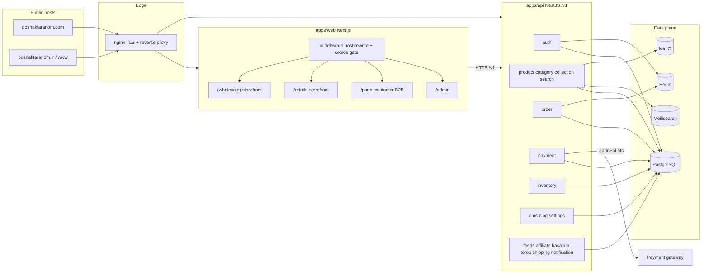
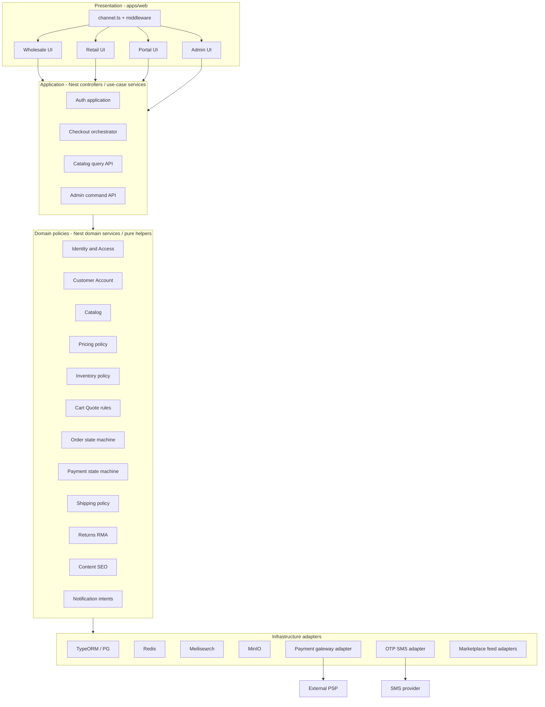
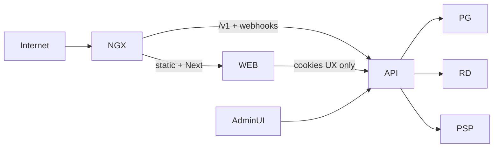
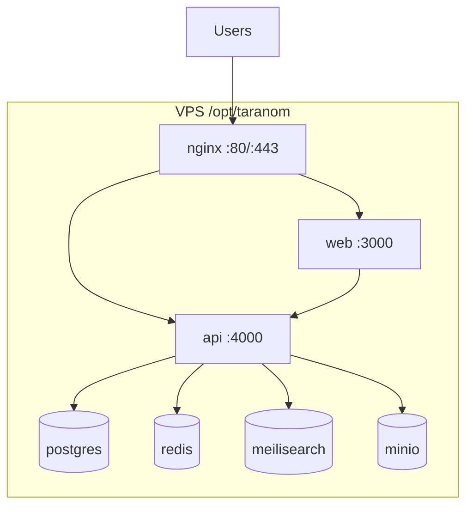

# Target Architecture — Retail & Wholesale Completion

**Task:** TASK-20260809-002  
**Program authority:** `Retail-Wholesale-Completion-Package/MASTER.md` + `02_TARGET_ARCHITECTURE.md`  
**Stance:** smallest compatible evolution of the existing Next.js / NestJS / PostgreSQL dual-channel system.  
**Non-goals (hard):** website builder, SaaS multi-tenancy, tenant provisioning, page/schema builders, template marketplaces, greenfield rewrite, new microservice mesh.

Evidence basis (code/docs inspected for this revision): `docs/B2C.md`, `README.md`, `docker-compose.yml`, `apps/web/src/middleware.ts`, `apps/web/src/lib/channel.ts`, `apps/web/src/app/(wholesale)|retail|portal|admin`, `apps/api/src/app.module.ts` + Nest modules under `apps/api/src/modules/*`, `.ai-dos/project/architecture.md`, `.ai-dos/project/overview.md`, checkout hardening report `docs/reports/2026-07-31-checkout-transaction-hardening.md`.

---

## 1. AI-DOS / decision-record reconciliation

| Record                                                                                 | Status                      | Notes                                                                                                |
| -------------------------------------------------------------------------------------- | --------------------------- | ---------------------------------------------------------------------------------------------------- |
| `.ai-dos/project/architecture.md` — dual-channel single core, Next/Nest/PG, nginx edge | **Verified**                | Matches middleware host rewrite, Nest module list, compose services.                                 |
| `.ai-dos/project/architecture.md` — “Smallest compatible evolution”; no builder/SaaS   | **Verified / binding**      | This document implements that decision.                                                              |
| `.ai-dos/project/architecture.md` — Phase-1 claims = governance + required docs        | **Verified**                | No `apps/*` changes implied by this ADR set.                                                         |
| `.ai-dos/project/overview.md` — stack, URLs, explicit non-goal builder                 | **Verified**                | Aligns with README + compose.                                                                        |
| `docs/B2C.md` — locked “one core + two storefronts”                                    | **Verified**                | Retail paths + CMS home blocks documented.                                                           |
| `docs/02-architecture.md` (if present in other checkouts)                              | **Stale / placeholder**     | TODO stub; **superseded for this program by this file** (`docs/02-target-architecture.md`).          |
| Formal `docs/adr/*` tree                                                               | **Missing**                 | ADRs live inline in §12 of this document until a dedicated ADR folder is claimed.                    |
| `docs/01-current-system-audit.md`                                                      | **Missing at write time**   | Target assumes evidence from code paths above; audit may refine risks without changing stack choice. |
| Any website-builder / multi-tenant platform proposal                                   | **Rejected / out of scope** | See §13.                                                                                             |

---

## 2. Principles (binding)

1. **Retain** npm workspaces monorepo, `apps/web` (Next 15), `apps/api` (Nest 10 + TypeORM), PostgreSQL, Redis, Meilisearch, MinIO, nginx reverse proxy, VPS docker-compose deploy.
2. **Modular monolith**, not microservices: Nest modules are the bounded contexts; extract a process only if ops evidence forces it.
3. **One authoritative commerce core** for price recalculation, inventory mutation, order/payment state machines; channel policy (retail vs wholesale) is explicit and localized—not scattered UI `if`s that invent totals.
4. **Server never trusts client totals** (price, stock, payable, discount, wallet).
5. **Adapters at the edge** for payment gateway, SMS/OTP, shipping quote providers, marketplace feeds (Basalam/Torob), object storage, search index.
6. **Versioned HTTP contracts** under `/v1/*`; URL/SEO compatibility on both public hosts.
7. **Admin-editable storefront content** stays CMS/settings-driven (`/admin/site-content`, settings, entity admin)—not a page builder runtime.

---

## 3. Current architecture (as-built)

### 3.1 Component / data-flow

### 3.2 Channel differentiation (current)

| Concern          | Wholesale (`.com`)                              | Retail (`.ir`)                              |
| ---------------- | ----------------------------------------------- | ------------------------------------------- |
| UI tree          | `app/(wholesale)/`, portal                      | `app/retail/` (host rewrite to `/retail/*`) |
| Channel signal   | default / header `x-taranom-channel: WHOLESALE` | host set + rewrite; header `RETAIL`         |
| Auth             | portal register/login (B2B approval)            | OTP `POST /auth/retail/otp/*`               |
| Price fields     | `wholesalePrice`                                | `retailPrice`                               |
| Stock fields     | `wholesaleStock` / legacy `stock`               | `retailStock`                               |
| Order type       | `WHOLESALE` (+ pack/MOQ paths)                  | `RETAIL_WEBSITE`                            |
| Payment defaults | CASH / INSTALLMENT / ONLINE                     | ONLINE (also CASH)                          |
| Content          | channel settings `WHOLESALE`                    | channel settings `RETAIL`; home CMS blocks  |

### 3.3 Nest modules (current inventory)

`auth`, `customer`, `product`, `category`, `collection`, `search`, `order`, `invoice`, `inventory`, `payment`, `discount`, `shipping`, `notification`, `cms`, `blog`, `settings`, `upload`, `dashboard`, `crm`, `rma`, `feeds`, `affiliate`, `basalam`, `torob`, `redis`.

Presentation packages: `@taranom/shared-types`, `@taranom/persian-utils` (types/utils only—not a second domain layer).

### 3.4 Known structural tensions (target must address without rewrite)

- Channel policy often lives as conditionals inside large services (especially `order.service`) rather than named policy objects.
- Pricing is not a separate module; it is embedded in product + order.
- Cart is client-side for retail (`retail-cart.ts`); authoritative totals only at checkout API.
- Inventory has channel stock fields and movement history; reservation/expiry semantics need explicit hardening (audit-driven).
- Payment verify is already partially idempotent; order creation supports `idempotencyKey`—must remain the contract.
- Checkout path was transaction-hardened (2026-07-31 report); concurrency tests still a gap.

---

## 4. Target architecture (evolution, not replacement)

### 4.1 Target component / data-flow

Same deployable units. Changes are **boundaries, ownership, and contracts inside the monolith**.

**Rule:** arrows point inward to domain; UI and Nest controllers do not call PSP/SMS SDKs directly; domain does not import Next.js or React.

### 4.2 Bounded modules (logical → Nest home)

| Bounded module     | Owns                                                                        | Nest home (current → target)                                                                                | Channel variance                                    |
| ------------------ | --------------------------------------------------------------------------- | ----------------------------------------------------------------------------------------------------------- | --------------------------------------------------- |
| Identity & Access  | JWT/session, roles, retail OTP, admin/portal gates                          | `auth` (+ web middleware cookie check as UX only)                                                           | OTP retail vs portal B2B                            |
| Customer / Account | customer profile, approval, wallet balance reads                            | `customer`, `crm`                                                                                           | Wholesale approval; retail account lighter          |
| Catalog            | products, variants, SKUs, categories, collections, publication              | `product`, `category`, `collection`                                                                         | Visibility/publication flags per channel if present |
| Pricing            | unit price selection, discount application rules, money rounding IRR        | **extract helpers inside** `product`/`order`/`discount` → later `pricing` folder **without new deployable** | `retailPrice` vs `wholesalePrice`                   |
| Inventory          | on-hand / channel stock, movements, allocation during checkout              | `inventory` (+ order txn participation)                                                                     | `retailStock` vs `wholesaleStock`                   |
| Cart / Quote       | client cart OK; server quote validation at checkout                         | web cart libs + order create DTO validation                                                                 | Pack/MOQ wholesale; simpler retail lines            |
| Checkout           | orchestration: validate → price → allocate → persist order → payment intent | `order` create path (keep transactional)                                                                    | Defaults for ship/pay methods                       |
| Order              | order aggregate, type, status transitions, snapshots                        | `order`, `invoice`                                                                                          | `RETAIL_WEBSITE` vs `WHOLESALE`                     |
| Payment            | attempts, verify, capture/fail, refunds linkage                             | `payment`                                                                                                   | Retail ONLINE-heavy                                 |
| Fulfillment        | shipping method selection, handoff to ops                                   | `shipping` + order status                                                                                   | Different default carriers                          |
| Returns            | RMA flows                                                                   | `rma`                                                                                                       | Policy may differ by channel                        |
| Content / SEO      | CMS blocks, blog, settings menus, sitemaps                                  | `cms`, `blog`, `settings`                                                                                   | `WHOLESALE\|RETAIL` keys                            |
| Notifications      | SMS/email intents after domain events                                       | `notification`                                                                                              | Template per channel                                |
| Reporting          | admin dashboards, feeds                                                     | `dashboard`, `feeds`, marketplace modules                                                                   | Read models; no dual write of commerce truth        |
| Search / Media     | index sync, uploads                                                         | `search`, `upload`                                                                                          | Shared assets                                       |

“Shared” means **one tested domain capability** used by both channels—not a junk drawer module.

### 4.3 Dependency rules

Allowed:

- `web` → `api` HTTP `/v1` only (plus Next rewrites to same origin where used).
- Nest **controller** → application/service → domain helpers → TypeORM entities/repos.
- Domain may depend on interfaces for clock, id, payment port, sms port.
- `packages/*` may hold DTO/types and pure money/date utils.

Forbidden:

- Domain/service importing UI or Next middleware.
- Web computing payable amounts that the API does not recompute.
- New cross-service RPC mesh, message bus, or second database “for cleanliness.”
- Circular Nest module imports; break with a narrow shared domain file or events-in-process if needed.
- Runtime multi-tenant schema/host routing beyond the existing two sales channels.

### 4.4 Contract changes (compatibility-first)

| Contract                    | Current                                            | Target                                                                                                          |
| --------------------------- | -------------------------------------------------- | --------------------------------------------------------------------------------------------------------------- |
| Public retail URLs on `.ir` | Middleware rewrite to `/retail/*`; bar stays clean | **Preserve**; any path move needs redirect + SEO review                                                         |
| Wholesale public + portal   | Existing routes                                    | **Preserve**                                                                                                    |
| API prefix                  | `/v1`                                              | Keep; additive fields preferred over breaking renames                                                           |
| Order create                | `type` / `channel`, `idempotencyKey`, server price | Keep; document channel enum normalization (`RETAIL` / `RETAIL_WEBSITE` → retail policy)                         |
| Payment verify              | Idempotent finalize                                | Keep; treat duplicate verify as success-no-op                                                                   |
| Channel header              | `x-taranom-channel`                                | Informational for web; **API authorizes from auth + explicit order channel fields**, not spoofable header alone |
| Search index                | Meilisearch product docs                           | Eventually-consistent; checkout/stock always from PG                                                            |

No API version bump required for completion unless a breaking fix is unavoidable; then dual-read or transitional DTO fields for one release.

---

## 5. Data ownership

| Data                        | System of record                          | Writers                          | Readers                       | Notes                                                     |
| --------------------------- | ----------------------------------------- | -------------------------------- | ----------------------------- | --------------------------------------------------------- |
| Product/variant/SKU, prices | PostgreSQL                                | Admin/API product module         | Web, search indexer, feeds    | Price change does not rewrite historical order lines      |
| Channel stock               | PostgreSQL                                | Inventory + checkout transaction | Catalog APIs                  | Channel fields co-owned with inventory policy             |
| Inventory movements         | PostgreSQL                                | Inventory service                | Admin                         | History is append; delete must not silently reverse stock |
| Cart (retail/wholesale UI)  | Browser (local)                           | Client                           | Client                        | Non-authoritative                                         |
| Orders + line snapshots     | PostgreSQL                                | Order module (txn)               | Portal, admin, invoices       | Snapshot unit price/qty at accept                         |
| Payments                    | PostgreSQL                                | Payment module                   | Order status sync             | Payment state ≠ order state                               |
| Customers / OTP challenges  | PostgreSQL + Redis (OTP/rate)             | Auth/customer                    | Admin CRM                     | OTP codes never logged in prod                            |
| CMS / settings              | PostgreSQL                                | Admin CMS/settings               | Storefronts                   | Keyed by channel                                          |
| Search documents            | Meilisearch                               | Search sync jobs                 | Storefront search             | Rebuildable from PG                                       |
| Media blobs                 | MinIO                                     | Upload module                    | CDN/nginx `/media`            | Public product bucket                                     |
| Sessions/tokens             | HTTP-only cookies + JWT validation in API | Auth                             | Middleware (presence/role UX) | Server enforces authorization                             |

**Write ownership rule:** only the owning module’s service performs mutations on its tables; other modules call that service (or join the same DB transaction via injected `EntityManager` as already started for checkout).

---

## 6. Failure, concurrency, and idempotency

### 6.1 Critical write behaviors (target)

| Operation                | Transaction                                                                 | Idempotency                                     | Concurrency                                             | Compensation                                             |
| ------------------------ | --------------------------------------------------------------------------- | ----------------------------------------------- | ------------------------------------------------------- | -------------------------------------------------------- |
| Create order             | Single DB txn: order rows + stock allocation + discount/wallet side effects | Client `idempotencyKey` → return existing order | Row-level locks / conditional stock updates on variants | Rollback txn; no post-commit best-effort stock fix       |
| Payment verify           | Persist terminal payment status once                                        | Re-verify returns prior success                 | Unique gateway authority / payment id                   | Order paid transition only after durable payment success |
| Inventory adjust (admin) | Per-adjust txn + movement row                                               | Optional request id for bulk                    | Serialize per variant/product                           | Explicit reverse adjust, not history delete              |
| OTP request              | Rate-limit in Redis                                                         | Same phone cooldown                             | N/A                                                     | Fail closed; no code in API response in prod             |
| Search reindex           | Async / job                                                                 | Upsert by product id                            | Stale index allowed briefly                             | Source of truth remains PG at checkout                   |

### 6.2 Failure modes to design for (tests later)

- Price/stock change between cart render and checkout → server rejects or reprices explicitly.
- Last-unit race across channels → one txn wins; loser gets stock error.
- Payment success, client loses response → verify/idempotent poll recovers.
- Duplicate/out-of-order gateway callbacks → ignore after terminal state.
- Meilisearch/MinIO/SMS down → browse degrade / upload fail / OTP fail; **checkout must not depend on search**.
- Redis down → fail closed on OTP/rate paths that require it; document cache fallbacks.

### 6.3 Order / payment state separation

- Order status transitions: explicit, authorized, audited; illegal/repeated transitions rejected.
- Payment attempt ≠ capture ≠ refund; do not overload order status for PSP internals.
- Maintain (in audit/tests) a transition table: trigger, guard, side effects, idempotency key, audit event, compensation.

---

## 7. Observability (minimum viable)

Retain and tighten—what on-call needs at 3am:

- Health: API `/v1/health` (and compose healthchecks for PG/Redis/Meili/MinIO).
- Structured logs on order create, payment verify, inventory allocate, auth failures (no secrets/PII beyond necessary ids).
- Correlation: request id from edge → API logs (add if missing—small change, not a new APM platform).
- Metrics/alerts (ops, not new product): 5xx rate, payment verify failures, checkout txn rollbacks, disk/backup age.
- No requirement for distributed tracing mesh unless evidence shows need.

---

## 8. Security boundaries

| Boundary          | Control                                                                                    |
| ----------------- | ------------------------------------------------------------------------------------------ |
| Edge              | TLS at nginx; bind app ports to localhost in compose; secrets in `.env` not images         |
| Channel hosts     | Host-based retail rewrite; admin/portal exempt; do not trust `x-taranom-channel` for money |
| AuthN             | JWT; retail OTP hashed; portal/admin role cookies mirrored for UX                          |
| AuthZ             | Enforced in Nest guards/services for admin, customer-owned orders, webhooks                |
| Webhooks / verify | Signature/authority validation per PSP; idempotent finalize                                |
| Uploads           | Validated content-type/size; no path traversal into host FS                                |
| SSRF / SSR        | Server-side fetch only to configured PSP/SMS endpoints                                     |
| Tenancy           | **Two sales channels, one merchant**—not tenant isolation                                  |

---

## 9. Deployment topology (unchanged shape)

- Local: compose data services + `npm run start:dev` / Next dev (per README).
- Prod: `docker compose` build/up; deploy via `scripts/auto-deploy.sh` / approved CI `workflow_dispatch`.
- Migrations: TypeORM migrations for production (`synchronize` is dev-only)—no schema change from this architecture doc alone.
- Rollback: previous image/compose revision + DB restore from backup (runbook owns procedure).

---

## 10. Transition sequence (incremental)

Ordered so each step is shippable and reversible. **No big-bang cutover.**

1. **Baseline & audit** — gates + `docs/01-current-system-audit.md` (evidence of P0/P1).
2. **Freeze architecture** — this document; reject builder/SaaS scope creep.
3. **Harden commerce invariants in place** — order/payment/inventory concurrency tests; close audit P0/P1 without new services.
4. **Localize channel policy** — extract pure helpers (`resolveChannel`, `unitPriceForChannel`, stock accessors) from fat services; behavior-identical refactor.
5. **Adapter cleanup** — payment/SMS/search behind narrow ports where edits already touch those files.
6. **Contract documentation** — OpenAPI/Swagger accuracy for retail OTP, order create, payment verify.
7. **Journey evidence** — retail and wholesale E2E acceptance recorded.
8. **Deploy/runbook** — backup, health, rollback rehearsal.
9. **Readiness verdict** — `docs/PLATFORM-READINESS-REPORT.md`.

Optional later (only if audit proves pain): physical Nest `PricingModule` folder move—**same process, same DB**.

---

## 11. Acceptance mapping (architecture)

| Criterion (package file 02)                  | How target meets it                                                 |
| -------------------------------------------- | ------------------------------------------------------------------- |
| Retail/wholesale differences locatable       | Channel policy helpers + table in §3.2/§4.2; UI trees already split |
| Domain not tied to UI/vendor                 | Nest domain + payment/SMS adapters; web is presentation             |
| Critical writes define txn/retry/idempotency | §6                                                                  |
| No multi-tenant/page-builder in runtime      | Explicit non-goal; CMS blocks ≠ builder                             |

---

## 12. Architecture decisions (ADRs)

### ADR-001 — Retain modular monolith (Next + Nest + PG)

- **Status:** Accepted
- **Context:** Dual-channel commerce already runs in one monorepo on one VPS.
- **Decision:** Keep a single API process and single Next app with route-group/channel split.
- **Consequences:** Simpler txns and deploy; must enforce module boundaries by convention and review.

### ADR-002 — Dual sales channel, single merchant (not multi-tenant)

- **Status:** Accepted
- **Context:** `.com` wholesale and `.ir` retail share inventory/admin.
- **Decision:** Channel is a first-class sales dimension (prices, stock, order type, content keys)—not tenant_id isolation.
- **Consequences:** Shared DB; explicit channel fields; no tenant provisioning work in this program.

### ADR-003 — Host rewrite for retail public URLs

- **Status:** Accepted (current behavior ratified)
- **Context:** Clean URLs on `.ir` while code lives under `app/retail`.
- **Decision:** Keep middleware rewrite; exempt admin/portal/api/media/payment.
- **Consequences:** SEO-stable public paths; local preview via `/retail` or force cookie/env.

### ADR-004 — Server-authoritative checkout transaction

- **Status:** Accepted (ratifies 2026-07-31 hardening)
- **Context:** Split stock/wallet/discount updates risk partial commits.
- **Decision:** Order accept + inventory + related side effects in one DB transaction; idempotency key on create.
- **Consequences:** Requires passing `EntityManager` into collaborators; concurrency tests still required.

### ADR-005 — Payment state machine separate from order status

- **Status:** Accepted
- **Context:** PSP retries and lost redirects.
- **Decision:** Payment module owns attempt/verify/refund durability; order moves to paid only after durable success; verify is idempotent.
- **Consequences:** Clearer recovery; UI must poll/reconcile rather than trust query-string alone.

### ADR-006 — Client cart, server quote

- **Status:** Accepted
- **Context:** Retail cart already client-side; wholesale similarly UX-driven.
- **Decision:** Keep client cart for UX/perf; every checkout recomputes price/stock/shipping server-side.
- **Consequences:** Slight UX mismatch possible on stale carts—prefer explicit error over silent trust.

### ADR-007 — CMS/settings configurability without a page builder

- **Status:** Accepted
- **Context:** Home blocks and channel settings are admin-editable today.
- **Decision:** Continue structured CMS/settings entities; forbid drag-and-drop/schema builder runtimes.
- **Consequences:** Marketing can edit within schemas; engineering owns new block types.

### ADR-008 — Ownership-aware RMA migration (no destructive adoption rollback)

- **Status:** Accepted (TASK-20260810-006 remediation)
- **Context:** `return_requests` may already exist (sync-era). `CREATE TABLE IF NOT EXISTS` + unconditional `DROP TABLE` in `down()` would destroy pre-existing RMA rows.
- **Decision:** `up()` records ownership in `schema_migration_ownership` only when it creates the table; adoption path is expand-only. `down()` drops FKs/indexes always, but `DROP TABLE` only when ownership exists. Production must not use `down()` for disaster recovery — restore from backup.
- **Consequences:** Safe re-run/up on empty and adopted DBs; adopted data survives rollback of this migration version; financial RMA history is preserved.

### ADR-009 — Non-production E2E environment identity

- **Status:** Accepted (TASK-20260810-006 remediation)
- **Context:** Env-overridable host allowlists and localhost tunnels can reach production.
- **Decision:** Immutable in-script allowlists; `GET /v1/env-identity` returns provisioned `DEPLOYMENT_IDENTITY` only for `APP_ENV` in `{staging,local,disposable}`; E2E compares against fixture written by `scripts/provision-e2e-identity.sh` (not casual test env). No SQL user/password mutation in the purchase harness.
- **Consequences:** Operators must provision identity + fixture users before E2E; misconfigured allowlists fail closed before login/orders.

---

## 13. Rejected alternatives

| Alternative                                                | Why rejected                                                                                   |
| ---------------------------------------------------------- | ---------------------------------------------------------------------------------------------- |
| Greenfield rewrite (new stack or “clean” monorepo)         | Destroys production URLs, data, and delivery timeline; no blocking constraint on Next/Nest/PG. |
| Microservices split (order/payment/inventory processes)    | Adds network failure modes and distributed txns; current VPS/modular monolith fits scale.      |
| Website-builder / page-builder / template marketplace      | Explicit program non-goal (MASTER); contaminates completion scope.                             |
| SaaS multi-tenant runtime / tenant billing                 | Wrong problem; one merchant, two channels.                                                     |
| Separate retail codebase or second API                     | Duplicates inventory/pricing bugs; contradicts “one core.”                                     |
| Event-sourced commerce or heavy CQRS bus                   | Over-engineering for current volume; PG transactional model sufficient.                        |
| Moving cart persistence to Redis as source of truth        | Adds consistency bugs; client cart + server quote is enough.                                   |
| Trusting `x-taranom-channel` or client prices for charging | Security/integrity failure mode.                                                               |

---

## 14. Open points (do not invent)

- Exact reservation/expiry semantics and any dual-channel stock contention bugs → **audit + tests**.
- Production PSP webhook vs redirect-only verify topology → confirm in audit against live config.
- Whether wallet, installment, and affiliate edge cases are in critical path for GO verdict → product/ops confirmation.
- Formal ADR directory vs inline ADRs here → process preference only; content above is binding for TASK-20260809-002.

---

## 15. Summary

The target is the **same dual-channel commerce system**, made **explicit and testable** at module boundaries: one Nest commerce core, two Next storefronts, shared PG inventory, adapter-wrapped externals, transactional checkout, idempotent payments, and CMS—not a platform. Evolution work is hardening and localization of channel policy, not topology redesign.
