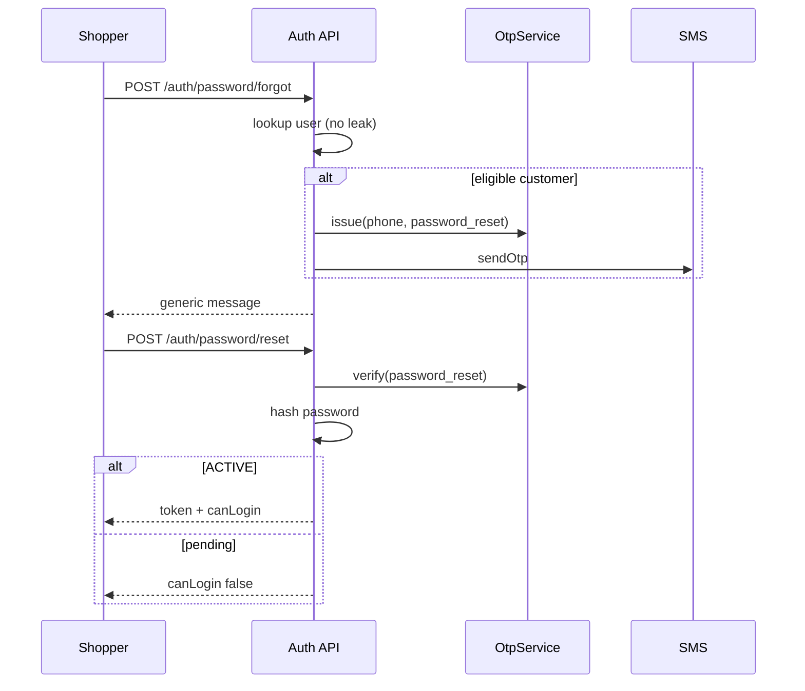

# Customer account panels + password recovery

Task: TASK-20260903-005  
Date: 2026-09-03

## Brief

Complete the shopper account for retail (`.ir`) and wholesale (`.com` portal), and make password set / forgot a real, secure flow instead of a support-only stub.

## Assumptions

- Retail primary login stays SMS OTP; password is optional after set/reset.
- Wholesale primary login stays phone + password; OTP is only for reset.
- Staff passwords are never changed by the public reset endpoints.
- No new notification inbox API in this slice (honest empty state).
- Wishlist remains device-local; no schema migration.

## Users and jobs

| User | Job |
|------|-----|
| Retail shopper | Enter account, see orders, edit profile/addresses, set or recover password |
| Wholesale buyer | Same in portal, plus invoices/payments/installments |
| Staff | Unchanged admin session; cannot be reset via customer OTP |

## Goals / non-goals

Goals: working forgot/reset/set; professional account chrome; order detail on retail; no user-enumeration on forgot; OTP namespace split from login.

Non-goals: server wishlist, notification feed, invoice IDOR rewrite, JWT revocation list, remember-me longer than existing 7-day token.

## Module map

- Identity: `AuthService` + `OtpService` purpose `retail` \| `password_reset`
- Retail UI: `apps/web/src/app/retail/account/*` + `RetailAccountShell` / `RetailAccountAuth`
- Wholesale UI: portal dashboard + `/portal/forgot-password`
- Shared UI: `ForgotPasswordFlow`, `PasswordField`, `password-policy`

## API

| Method | Path | Auth | Notes |
|--------|------|------|-------|
| POST | `/v1/auth/password/forgot` | public | Same message whether phone exists |
| POST | `/v1/auth/password/reset` | public | OTP purpose `password_reset` only; 400 not 401 |
| POST | `/v1/auth/me/password/set` | JWT | No current password (OTP users) |
| PATCH | `/v1/auth/me/password` | JWT | Requires current; policy min 8 |

## Security

- Reset OTP cannot verify a retail-login OTP (separate Redis keys).
- Staff / blocked / no-customer phones get the generic forgot response and no SMS.
- Password policy: min 8, no whitespace, not equal to phone, not a single repeated character.
- Register min length aligned to 8; login still accepts older 6-char passwords.
- Forgot does not return `sent` for missing users. `devCode` only when SMS is off and non-prod expose flag is on.
- Public reset never issues a token for pending/inactive wholesale accounts.

## Critical sequences

## Screens

Retail: `/account` overview + OTP/password login; `/account/orders`, `/orders/[id]`, profile, addresses, security, wishlist, returns, forgot-password.

Wholesale: working `/portal/forgot-password`; `/portal/dashboard/security`; sidebar uses real profile; notifications are empty-on-purpose.

## Risks

- Stolen OTP-session JWT can still call `password/set` until the session flag expires (~30 min).
- Forgot cooldown/SMS failure now return the same generic 200 (no phone oracle).
- Retail post-login `redirect` is same-origin path only.
- Security [بازبین امنیت](f4d5d4ae-39f5-4569-81ec-01b1aca87781) and Reviewer [بازبین پنل](40150946-2472-4a33-bb77-d5bef96f9c3f): both **PASS WITH CONDITIONS**; no must-fix. Task done.

## Rollback

Revert this branch. No migration. OTP key change is additive (`otp:password_reset:*`); retail keys stay `otp:retail:*`.
