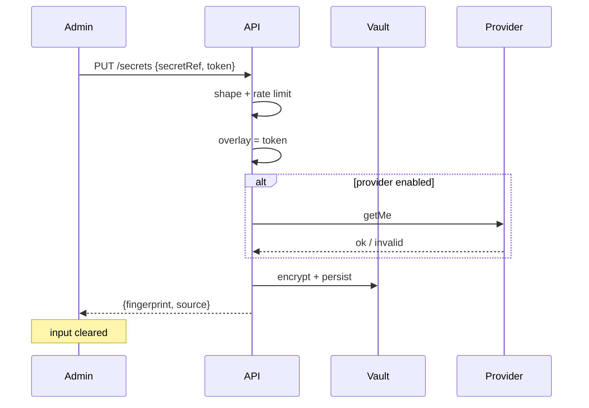

# Omnichannel write-only token field

Date: 2026-09-06  
Task: TASK-20260905-003  
Skills: tap-solution-architecture, ui-ux-product-design, design

## Goals

Owner can paste each messenger bot token (Telegram, Bale, Rubika) once in `/admin/omnichannel` without SSH, then the system posts automatically with the existing one-time setup.

## Non-goals

- Storing plaintext tokens in connection rows, audits, logs, or GET responses
- A general secrets manager / Vault product
- Changing live connector flags
- Instagram or other undocumented APIs

## Assumptions

- Production API already has `JWT_SECRET` (≥16 chars; prod requires 32). That is the default wrapping key.
- Optional `OMNICHANNEL_VAULT_KEY` (≥32 chars) can replace JWT for wrapping.
- Settings admin only writes allowlisted groups; it cannot read `omnichannel.secret.vault`.
- One API container + one worker process; worker refreshes the overlay at most every 15s.

## Context

Until this change, `secretRef` was an env name only. `assertNoPlaintextSecrets` rejected any token-shaped body. That was correct for CRUD, but the owner could not finish Bale/Rubika setup without SSH. The new surface is a **dedicated write-only command**, not a new column on connections.

## Actors and trust boundary

```
Admin browser  --HTTPS+JWT+ADMIN-->  API PUT /omnichannel/secrets
                                      | encrypt AES-256-GCM
                                      v
                                   app_settings.omnichannel.secret.vault
                                      |
                                      +--> in-process overlay (API)
                                      +--> worker hydrate (15s)
                                      v
                                   resolveProviderToken(provider, secretRef)
                                      v
                                   official Bot API (getMe / send*)
```

The browser holds the token only in a password input until save. After save the field is cleared. GET `/omnichannel/status` returns `configured`, `source`, and an 8-hex SHA-256 fingerprint — never the token.

## Modules

| Module | Owns |
|---|---|
| `omnichannel-token-vault.ts` | Crypto, shape checks, in-process overlay |
| `OmnichannelTokenVaultService` | Persist / hydrate ciphertext |
| `OmnichannelService.putSecret` | Authz, rate limit, optional live `getMe`, audit |
| `resolveProviderToken` | Vault overlay first, then env |
| `AdminOmnichannel` + `WriteOnlySecretField` | Write-only UI |

Connection rows still store only `secretRef`.

## Data

`app_settings` key `omnichannel.secret.vault`:

```json
{
  "v": 1,
  "entries": {
    "BALE_BOT_TOKEN": {
      "alg": "aes-256-gcm",
      "iv": "<b64>",
      "tag": "<b64>",
      "ct": "<b64>",
      "fingerprint": "a1b2c3d4",
      "updatedAt": "2026-09-06T00:00:00.000Z"
    }
  }
}
```

Retention: until the admin clicks «حذف توکن پنل». Env tokens are never deleted by that action.

## API

| Method | Body | Response |
|---|---|---|
| `PUT /omnichannel/secrets` | `{ secretRef, token, reason? }` | `{ secretRef, configured, source, fingerprint, updatedAt }` |
| `DELETE /omnichannel/secrets/:secretRef` | — | same public shape |
| `GET /omnichannel/status` | — | `providers[].tokenConfigured` + `secrets[]` |

All three stay behind JWT + ADMIN + `OmnichannelAdminGuard`.

Idempotency: replacing a token rotates the ciphertext. Rate limit: 8 writes / 10 minutes / actor.

`probeCredential` (`getMe`) always runs **before** persist, including when the provider send-gate is off. A rejected token is not stored. Secret PUT does not send `reason` (audits stay null).

## Security

Revision 2026-09-06 13:40Z — independent review PASS WITH CONDITIONS; Medium remediations:

- Production/staging require `OMNICHANNEL_VAULT_KEY` (≥32). JWT is a local/dev wrap only; rotating JWT does not rotate the vault KEK.
- Persist uses in-process serialize + `SELECT FOR UPDATE` on `omnichannel.secret.vault`.
- Missing wrap key clears the overlay (worker cannot keep a deleted token forever).
- GCM AAD binds `secretRef`. Legacy ciphertext still opens without AAD.
- `assertNoVaultLeak` also rejects `"token"` keys, Telegram-shaped strings, and overlay values.
- DELETE shares the 8/10 min write cap. Settings `getAll()` exclude left to TASK-20260906-001 (file still claimed).

- General CRUD still runs `assertNoPlaintextSecrets` (field name `token` is forbidden there).
- Dedicated endpoint accepts `token` only; sibling fields are still scanned.
- AES-256-GCM; wrap key = scrypt(`OMNICHANNEL_VAULT_KEY`, salt `omnichannel-secret-vault-v1`).
- Audit payload: `secretRef`, `fingerprint`, `rotated`, `liveCheck` — no ciphertext, no token, no reason.
- Worker and API never copy vault tokens into `process.env`.
- Settings `GROUPS` allowlist cannot read this key.

### Threats

| Threat | Mitigation |
|---|---|
| Token in GET / listConnections | Not stored on the row; overlay is process-local |
| XSS stealing the input | Same admin origin + CSP as today; field cleared after save |
| CSRF | Bearer JWT, not cookie-only |
| DB dump | Ciphertext only; wrapping key is env |
| Log leak | Errors are generic Persian codes; adapters already redact bot URLs |
| Cross-provider paste | `secretRef` must match `TELEGRAM_|BALE_|RUBIKA_` and token shape matches provider |
| Worker stale token | Hydrate every 15s |
| Brute save | 8 / 10 min |

## UI

Revision 2026-09-06 13:10Z: three always-visible write-only cards (Telegram / Bale / Rubika) at the top of step 1, not one field behind a selected platform. Custom `secretRef` stays behind «نام متغیر سفارشی».

One token card per messenger:

- Persistent label, LTR password input, نمایش/پنهان, paste-friendly (`autocomplete=off`)
- Status badge: ذخیره نشده / از این پنل / روی سرور / هر دو
- Fingerprint only after save
- Confirm before deleting the vault entry
- Empty / invalid / server-disabled / rate-limit states use existing Callout / error banner

Visual language reuses the console tokens (rounded-2xl, Badge, btn-primary). No new JS library.

## Critical sequence



## Tests

- `omnichannel-token-vault.spec.ts`: round-trip, tamper, shape, overlay wins over env, no leak
- Existing secrets spec still rejects `token` on CRUD bodies
- Phase-acceptance: dedicated route, password field, vault key name

## Rollout

1. Deploy API + web + worker (same image).
2. Owner pastes Telegram only if they want to rotate; existing `TELEGRAM_BOT_TOKEN` env still works.
3. Owner pastes Bale / Rubika tokens in the new field.
4. «تست توکن» then channel verify as before.

Rollback: revert the release. Encrypted rows in `app_settings` become unused; env tokens keep working.

## Risks and confirmations

- Wrapping key tied to `JWT_SECRET` means rotating JWT without `OMNICHANNEL_VAULT_KEY` makes vault entries unreadable (env tokens still work). Confirmation: set a dedicated `OMNICHANNEL_VAULT_KEY` if JWT is rotated often.
- Ciphertext lives in Postgres backups. Acceptable vs SSH-only env; key is not in the dump.
- Independent security review still required (new secret write path).
