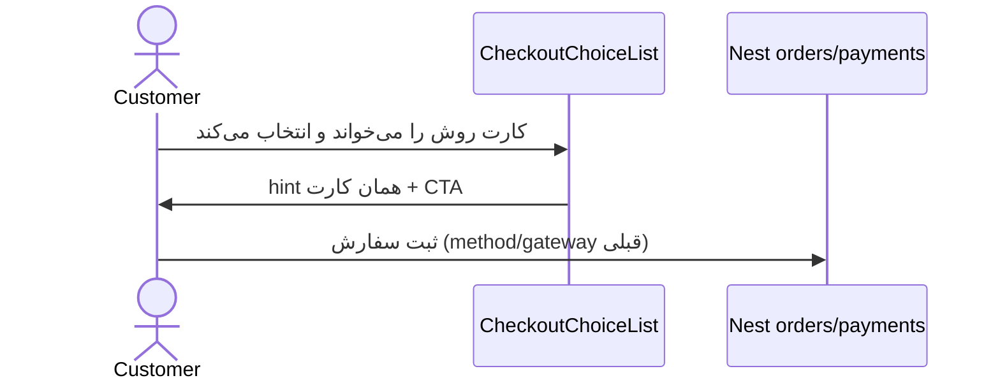

# توضیح ساده روش پرداخت + لوگوی هر درگاه

تاریخ: ۲۰۲۶-۰۹-۰۹  
تسک: TASK-20260909-002

## هدف و غیرهدف

- **هدف:** در چک‌اوت تکی و عمده، زیر هر روش پرداخت متنی باشد که برای مشتری بدون پیش‌زمینه (تقریباً ۱۵ ساله) قابل فهم باشد، و لوگوی خود همان روش دیده شود.
- **غیرهدف:** روش پرداخت جدید، تغییر adapter، webhook، مبلغ، یا payload سفارش.

## فرض‌ها

- روش‌های مجاز همان eligible فعلی است: تکی زرین‌پال / دیجی‌پی / ترب‌پی / پرداخت هنگام تحویل؛ عمده آنلاین زرین‌پال / نقدی / اقساط فروشگاه.
- یافتهٔ تحقیق کاربری تازه نداریم؛ لحن ساده یک **فرض محصول** است نه نقل‌قول کاربر.
- لوگوهای زرین‌پال، دیجی‌پی و ترب از دارایی رسمی سایت خودشان گرفته شد (نه تولید مصنوعی).

## زمینه سیستم

مشتری در `/checkout` (عمده) یا چک‌اوت تکی `.ir` روش را انتخاب می‌کند. تصمیم واقعی پرداخت روی API می‌ماند؛ UI فقط برچسب و علامت است.

```
Checkout page
  → CheckoutChoiceList (radiogroup)
      → checkout-payment-ui.ts (copy + logo key)
      → PaymentBrandLogo (static /payments/*)
API /orders + /payments/start   unchanged
```

## ماژول و مالکیت داده

| قطعه | مالکیت |
|---|---|
| متن و کلید لوگو | `apps/web/src/lib/checkout-payment-ui.ts` |
| رادیو کارت + مقدمه | `CheckoutChoiceList.tsx` |
| علامت برند | `PaymentBrandLogo.tsx` + `public/payments/` |
| انتخاب و payload | صفحات چک‌اوت (دست‌نخورده؛ متعلق به تسک ارسال حضوری) |

مقدمهٔ بخش داخل خود لیست است (`legend === روش پرداخت`) تا صفحات چک‌اوتِ قفل‌شده ویرایش نشوند.

## قرارداد UI

- `CheckoutChoiceOption.logo`: `zarinpal | digipay | torobpay | cash | installment`
- کاشی لوگو همیشه سفید می‌ماند تا رنگ برند برعکس نشود.
- ارسال همچنان آیکون Lucide کامیون دارد (بدون لوگو).

## امنیت

بدون تغییر secret، webhook، احراز، یا اعتماد به مبلغ کلاینت. فقط دارایی استاتیک + متن.

## استقرار

فایل‌های استاتیک داخل ایمیج Next می‌آیند. کش HTML چک‌اوت `no-store` است.

## توالی انتخاب (بدون تغییر سرور)



## تست و انتشار

- `checkout-payment-ui.spec.ts`
- `tsc` وب
- رول‌آوت: merge به master + auto-deploy؛ rollback با revert همین commit.

## ریسک

- لوگوی ترب از `torob.com/static/icons` است؛ اگر ترب هویت را عوض کند باید فایل عوض شود.
- متن طولانی‌تر کارت را در موبایل کمی بلندتر می‌کند؛ حجم JS اضافه نشد.

## تصمیم نیازمند تأیید

- لحن خیلی ساده برای عمده‌فروش حرفه‌ای ممکن است بیش از حد خودمانی باشد؛ اگر مالک بخواهد نسخهٔ کوتاه‌تر عمده جدا شود.
